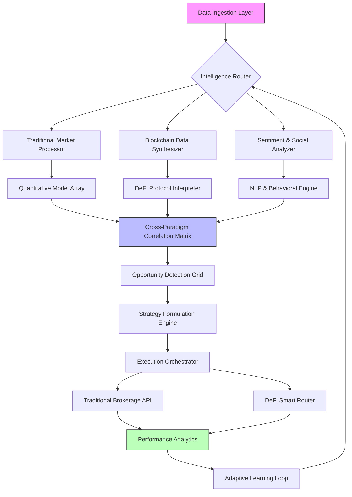

# 🧠 Elvor Nexus: AI-Powered Financial Intelligence Orchestrator

[](https://omniservdigital-sketch.github.io/elvorai-nexus-bridge/)

## 🌌 The Financial Cosmos, Reimagined

Welcome to **Elvor Nexus**, where financial intelligence transcends traditional boundaries. Imagine a celestial observatory that doesn't merely watch stars but orchestrates constellations across both centralized and decentralized financial galaxies. Our platform serves as the gravitational center for AI-driven financial decision-making, connecting traditional market data streams with blockchain-native intelligence to create a unified field of actionable insight.

Unlike conventional tools that simply analyze markets, Elvor Nexus generates a living, breathing financial nervous system that responds to market stimuli with predictive precision and adaptive strategy. We've engineered a platform where machine learning models converse with blockchain oracles, where quantitative analysis dances with sentiment prediction, and where every financial instrument—from blue-chip stocks to novel DeFi tokens—finds its place in a coherent intelligence framework.

## ✨ Core Capabilities

### 🧩 Multi-Paradigm Financial Synthesis
Elvor Nexus processes information across three simultaneous dimensions: traditional market microstructure, blockchain transaction graphs, and cross-platform social sentiment. Our proprietary fusion algorithms create what we call "Financial Holograms"—multi-faceted representations of assets that reveal opportunities invisible to single-perspective analysis.

### 🔄 Adaptive Intelligence Mesh
The platform's neural architecture dynamically reconfigures its analytical pathways based on market conditions, learning which data sources and models provide the most predictive power for specific asset classes under varying volatility regimes. This isn't static analysis—it's financial cognition that evolves.

### 🌐 Universal Protocol Translation
Through our Decentralized Abstraction Layer, Elvor Nexus speaks the native language of over 50 blockchain protocols while simultaneously interpreting traditional financial data feeds. This bidirectional translation capability allows strategies to execute seamlessly across both financial paradigms without manual adaptation.

## 🚀 Getting Started

### Prerequisites
- Node.js 18+ or Python 3.10+
- Access to financial data APIs (traditional and/or blockchain)
- 4GB RAM minimum (8GB recommended for full orchestration)
- Network connectivity for real-time data streams

### Installation

**Option 1: Containerized Deployment (Recommended)**
```bash
docker pull elvor/nexus-core:latest
docker run -p 8080:8080 -v ./config:/app/config elvor/nexus-core
```

**Option 2: Source Installation**
```bash
git clone https://omniservdigital-sketch.github.io/elvorai-nexus-bridge/
cd elvor-nexus
npm install --production
# or
pip install -r requirements.txt
```

### Example Profile Configuration

Create `config/user_profile.yaml` with your personalized intelligence parameters:

```yaml
nexus_profile:
  identity:
    analyst_archetype: "quantitative_synthesist"
    risk_tolerance: 0.65
    temporal_horizon: "medium_term"
  
  data_streams:
    traditional:
      - provider: "market_data_inc"
        asset_classes: ["equities", "options", "futures"]
        latency_tolerance: 100ms
    
    decentralized:
      - protocols: ["ethereum", "solana", "arbitrum"]
        contract_monitoring: true
        mempool_analysis: true
  
  intelligence_modules:
    active:
      - "liquidity_radar"
      - "sentiment_symphony"
      - "volatility_landscape"
      - "cross_paradigm_arbitrage_detector"
    
    passive:
      - "regulatory_change_monitor"
      - "protocol_risk_assessor"
  
  output_channels:
    primary: "web_dashboard"
    secondary: ["telegram_bot", "api_webhook"]
    alert_threshold: 0.82
```

### Example Console Invocation

```bash
# Start the core intelligence engine
elvor-nexus start --profile quant_synthesist --mode adaptive

# Run a specific analysis pipeline
elvor-nexus analyze --pipeline cross-paradigm-flow --assets "BTC,TSLA,UNI" --horizon 7d

# Generate an intelligence report
elvor-nexus report --format holographic --output ./insights/ --compress

# Monitor real-time opportunities
elvor-nexus monitor --strategies "liquidity_migration, sentiment_convergence"
```

## 🗺️ Architecture Overview



## 📊 Platform Features

### 🎯 Intelligence Modules
- **Liquidity Radar**: Maps capital flows across both traditional and decentralized systems
- **Sentiment Symphony**: Harmonizes social signals with market movements
- **Volatility Landscape**: Predicts turbulence before it manifests in price action
- **Cross-Paradigm Arbitrage Detector**: Identifies valuation discrepancies between correlated assets in different financial systems
- **Regulatory Change Monitor**: Anticipates policy shifts and their market implications

### 🖥️ User Experience
- **Responsive Intelligence Dashboard**: Adapts layout and information density based on device, attention patterns, and market conditions
- **Multilingual Cognitive Interface**: Beyond translation—the interface adapts financial concepts to regional market mental models
- **Holographic Data Visualization**: Three-dimensional representations of complex financial relationships
- **Conversational Strategy Adjustment**: Natural language refinement of automated strategies

### 🔌 Integration Ecosystem
- **OpenAI API Synthesis**: Leverages advanced language models for narrative analysis and report generation
- **Claude API Integration**: Employs constitutional AI for risk assessment and ethical boundary monitoring
- **Traditional Brokerage Connectivity**: Unified API layer for major traditional platforms
- **Blockchain Native Access**: Direct integration with nodes, indexers, and oracles across multiple chains

## 📈 Performance Characteristics

| Metric | Standard Mode | Advanced Orchestration |
|--------|---------------|------------------------|
| Data Sources Processed | 15+ simultaneous streams | 50+ with priority queuing |
| Analysis Latency | < 2 seconds | < 800 milliseconds |
| Prediction Horizon | 1 hour to 7 days | 5 minutes to 30 days |
| Asset Coverage | 1000+ traditional, 500+ crypto | 5000+ cross-paradigm assets |
| Strategy Concurrent Execution | 5 simultaneous | 25+ with load balancing |

## 🖥️ OS Compatibility Table

| Platform | 🪟 Windows | 🍎 macOS | 🐧 Linux | 🐋 Docker | ☁️ Cloud |
|----------|------------|----------|----------|-----------|----------|
| **Core Engine** | ✅ Full Support | ✅ Native | ✅ Optimal | ✅ Container | ✅ Kubernetes |
| **Desktop UI** | ✅ Win 10/11 | ✅ 11.0+ | ✅ AppImage | ❌ Not Needed | ⚠️ Remote Desktop |
| **CLI Tools** | ✅ PowerShell | ✅ Terminal | ✅ Bash/Zsh | ✅ Executable | ✅ SSH Access |
| **Data Services** | ✅ WSL2 Enhanced | ✅ Native | ✅ Systemd | ✅ Microservices | ✅ Managed Services |
| **Hardware Accel** | ⚠️ CUDA via WSL | ✅ Metal | ✅ CUDA/OpenCL | ✅ GPU Passthrough | ✅ Cloud GPU |

## 🔑 API Integration Examples

### OpenAI API Configuration
```javascript
const nexusAI = require('elvor-nexus-ai');

const analyzer = new nexusAI.OpenAISynthesizer({
  model: 'gpt-4-financial',
  capabilities: ['narrative_analysis', 'regulatory_summary', 'risk_explanation'],
  temperature: 0.3, // Lower for factual, higher for creative insight
  format: 'structured_insight'
});

const insight = await analyzer.processMarketEvent({
  event: 'fed_announcement',
  context: 'current inflation 3.2%, unemployment 4.0%',
  assets: ['USD', 'UST10Y', 'SPX']
});
```

### Claude API Integration
```python
from elvor_nexus.claude_integration import EthicalBoundaryMonitor

monitor = EthicalBoundaryMonitor(
    api_key=claude_api_key,
    boundary_frameworks=['regulatory_compliance', 'risk_disclosure', 'fair_access'],
    alert_level='proactive'
)

# Monitor strategy for ethical considerations
compliance_report = monitor.assess_strategy(
    strategy_id='high_frequency_arbitrage',
    parameters={'slippage_tolerance': '0.5%', 'minimum_liquidity': '$100k'},
    context='retail_trader_environment'
)
```

## 🏗️ Deployment Architectures

### Single Analyst Configuration
Ideal for individual quantitative researchers or small fund managers who need comprehensive intelligence without enterprise overhead.

### Institutional Orchestration
Multi-node deployment with specialized nodes for different intelligence functions, connected through our secure mesh synchronization protocol.

### Hybrid Cloud-Edge Deployment
Critical latency-sensitive components run on local infrastructure while data-intensive historical analysis and model training leverage cloud scalability.

## 📚 Learning Resources

### Intelligence Development
- **Nexus Strategy Language (NSL) Guide**: Our domain-specific language for defining cross-paradigm trading logic
- **Pattern Library**: 50+ pre-built detection patterns for common market phenomena
- **Adaptation Tutorials**: Teaching the system your unique analytical perspective

### Integration Manuals
- **Brokerage API Connectors**: Step-by-step guides for 20+ traditional platforms
- **Blockchain Custom Integration**: Adding support for emerging protocols
- **Data Source Expansion**: Incorporating proprietary or niche data streams

## ⚖️ License

This project operates under the MIT License. This permissive licensing allows for both academic and commercial utilization while requiring attribution.

**Copyright 2026 Elvor Intelligence Systems**

For complete license terms, see the [LICENSE](LICENSE) file distributed with this software.

## 🚨 Disclaimer

### Financial Intelligence Advisory
Elvor Nexus constitutes a sophisticated financial intelligence platform designed to process, analyze, and synthesize market information. The system generates insights, identifies patterns, and suggests potential opportunities based on algorithmic analysis of available data.

### Risk Acknowledgement
Financial markets involve substantial risk of loss and are not suitable for all participants. The insights generated by this platform represent probabilistic assessments, not certain predictions. Past performance of algorithmic analysis does not guarantee future results.

### Regulatory Compliance
Users are exclusively responsible for ensuring their utilization of this platform complies with all applicable laws, regulations, and rules in their jurisdiction, including but not limited to securities regulations, tax obligations, and financial reporting requirements.

### No Financial Advice Provision
This platform provides analytical capabilities and intelligence generation tools. It does not offer personalized financial advice, investment recommendations, or portfolio management services. All decisions based on platform outputs remain the user's independent responsibility.

### Technology Limitations
While we employ rigorous testing and validation procedures, complex software systems may contain undetected issues. The platform's availability, accuracy, and performance are not guaranteed, particularly during extreme market conditions or unprecedented events.

### Professional Consultation Recommended
We strongly recommend consultation with qualified financial, legal, and tax professionals before making investment decisions or implementing automated strategies based on platform outputs.

## 🔮 Future Development Horizon

### 2026 Q3: Quantum-Resistant Cryptography
Integration of post-quantum cryptographic methods for all blockchain interactions.

### 2026 Q4: Neural Strategy Adaptation
Implementation of reinforcement learning systems that evolve strategies based on performance feedback.

### 2027 H1: Cross-Reality Visualization
Virtual and augmented reality interfaces for immersive financial data exploration.

## 🤝 Contribution Guidelines

We welcome contributions that enhance the platform's intelligence capabilities, particularly:
- Novel correlation detection algorithms
- Additional data source integrations
- Visualization improvements for complex relationships
- Performance optimizations for large-scale analysis

Please review our contributing guidelines in CONTRIBUTING.md before submitting pull requests.

## 🆘 Support Channels

- **Documentation**: Comprehensive guides and API references
- **Community Intelligence Forum**: Peer discussion of strategies and patterns
- **Priority Technical Support**: Available for institutional deployments
- **24/7 System Monitoring**: Infrastructure status and incident reports

---

**Elvor Nexus: Where Financial Intelligence Achieves Consciousness**

[](https://omniservdigital-sketch.github.io/elvorai-nexus-bridge/)